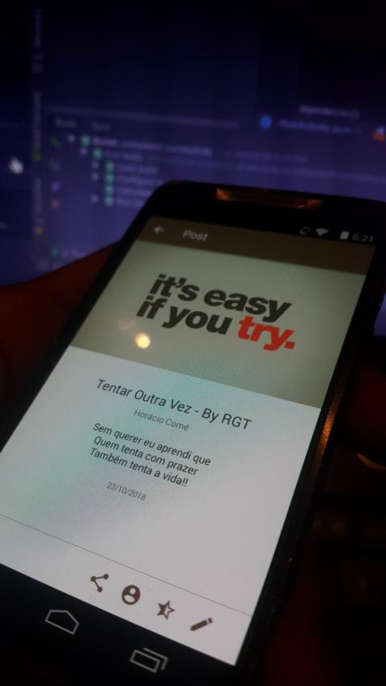
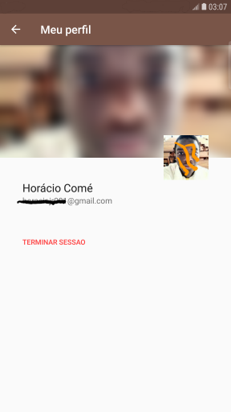

# Literal M
Android app that serves as front-end to the mozambican literature (poems, lyrics, books and more).

## Getting started
These instructions will get you a copy of the project so you can run it on your mobile or develop.
You can also find on this a brief about how this app works, licenses, screenshot and how to contribute.

## Pre-requesites
It should be working on an android phone running [Ice Cream Sandwich API 16](https://developer.android.com/about/versions/android-4.0-highlights) version 4.1 or later.
If you worryied about RAM and ROM, stop! It only needs about 20 MB of storage for basic installation. But the size increases as you save more data. And RAM dont even come to talk.
### For developers only
It was built using [Android Studio](https://developer.android.com/studio/features/) 3.2.1 with the latest gradle and patterns and latest Firebase SDKs.

## Version
This is an alpha version and all the data is on the cloud. You may find some bugs i believe so (not that i did found it). Please report.
From the settings panel you can go to the support channel (actually it is a whatsapp group), or check for new releases.

### For developers only
I use git for versioning. Please read Contributing section.

## Licenses
   Copyright 2018 Horácio Flávio Comé Júnior

   Licensed under the Apache License, Version 2.0 (the "License");
   you may not use this file except in compliance with the License.
   You may obtain a copy of the License at

       http://www.apache.org/licenses/LICENSE-2.0

   Unless required by applicable law or agreed to in writing, software
   distributed under the License is distributed on an "AS IS" BASIS,
   WITHOUT WARRANTIES OR CONDITIONS OF ANY KIND, either express or implied.
   See the License for the specific language governing permissions and
   limitations under the License.

   I DO NOT TAKE ANY KIND OF CREDIT FOR THE PICTURES USED IN THE POSTS. THEY'RE ALL THIRD PARTY AND I JUST DOWNLOADED THEM FROM THE WEB!
   
## Contributing
All pull requests are welcome. Please be expressive so other can even understand.

## Screenshots
App uprunning on an [Nougat](https://www.android.com/versions/nougat-7-0/) phone

     
